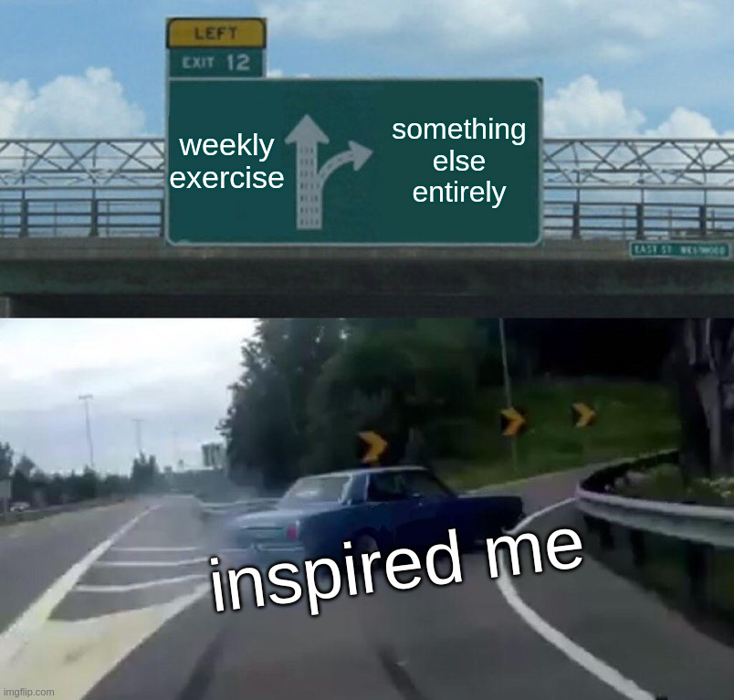

# Intermediate Creative Coding

An up to date version of this syllabus can be found at: https://aphid.github.io/ct120/syllabus.html. 

**📆📆📆 [JUMP TO THE SCHEDULE](#course-schedule) 📆📆📆**

## Course Info

* **Term:** Spring 2026
* **Meeting Times:** Tu/Th, 1:30 PM - 3:05 PM
* **Location:** [Zoom](https://canvas.ucsc.edu/courses/93093/external_tools/6680)
* **Course Chatroom:** [info/link here]()

## Instructor Information

*   **Instructor:** 
    *   **Name:** Abram Stern, Ph.D. (they/he) ETHAN IS TAKING OVER THE CLASS
    *   **Email:** [aphid@ucsc.edu](mailto:aphid@ucsc.edu)
    *   **Office Hours:** Tues from 3:05-4:05 (and ad-hoc on Matrix)
*   **Teaching Assistant:** 
    *   **Name:** Lilly Selzer (she/her)
    *   **Email:** [lselzer@ucsc.edu](mailto:lselzer@ucsc.edu)
    *   **Office Hours:** Wed from 2pm-4pm. (link [here]())

## Quick Links

*   **[Course Canvas]()**
*   **[Course Zoom]()**
*   **[Readings]()**
*   **[Office Hour Info]()** (zoom links here)

## Course Description

Project-driven practicum in arts and design applications of computer languages. Students apply new approaches to ongoing individual and collaborative projects. Students learn to code “from scratch,” rather than through the modification of prototype examples. Explore how programming languages function not only as tools but as institutional frameworks, sometimes invisibly shaping social norms and contemporary art and design practices; learn conscientious uses of code that can contribute to accessible technology and the empowerment of audiences, users, and media consumers.

## Learning Objectives

**Digital Literacy (Introduced)**

Gain literacy in creative tools for digital expression, and in the effective use of technology in arts and design: including digital platforms and algorithms, AI- and algorithmic arts and design tools, and emerging technology in a variety of media.

**Strategies for Creative Practice (Introduced)**

Learn strategies for bringing complex work to completion, individually and collaboratively, across a variety of media, including written, image- and sound-based, performance-based, and socially engaged media.

**Cultivation of Collaborative Growth (Introduced)**

Cultivate a mindset of curiosity, dialogue, and growth, with respect to one’s work and process, and its social and ethical impact. We learn from mistakes as well as triumphs—ours and others’—as we work toward meaningful creative work and social change.

## Grade Calculation

* **Attendance and Participation**: 25%
* **Weekly Exercises**: 40% total (divided among 8-10)
* **Code Review**: 25%
* **Critique**: 10%

## Grading Policy/Assessment

This course will focus on _qualitative_ not quantitative assessment, something we’ll discuss during the class, both with reference to your own work and the works we’re studying. While you will get a final grade at the end of the term, we will not be assigning numeric or alphabetic grades to individual assignments, but rather asking questions and making comments that engage your work rather than simply evaluate it. You will also be reflecting carefully on your own work. The intention here is to help you focus on working in a more organic way, as opposed to working as you think you’re expected to. If you are worried about your grade, your best strategy should be to participate in class, do the readings, and complete the assignments. You should consider this course a “busy-work-free zone.” If an assignment does not feel productive, come to office hours and we can find ways to modify, remix, or repurpose the instructions.

At the midpoint and end of the quarter, you will write a short self assessment of the work you have done to that point and what has/hasn’t worked for you in the course. Answer to the best of your ability and don’t overthink the process. There are no trick questions.

If this process causes more anxiety than it alleviates, come to office hours at any point to confer with me or the Teaching Assistant about your progress. 

## The "Offramp"

The offramp is a course policy in CT 120 that allows students to, on a week-by-week basis, work on an **approved** project instead of the weekly exercise (more on approval in a moment). This is to allow you to spend time on something that will take more than a week (perhaps several, perhaps the entire quarter if you're feeling ambitious). 

In lieu of the weekly exercise, if you have taken the offramp, you should instead turn in an weekly progress report detailing what you worked on, how it's going, and links to any working code (even if the project is incomplete). These check-ins can be similar in scope to the weekly checkins from CT 20.

Approval for an off-ramp project can happen a few different ways. You can ask during office hours or you can message the instructor or TA (chatroom, mail, or via canvas), or in the "1-on-1" room during one of the open lab times on thursday with a brief proposal.

### Offramp FAQ

*If I spend a couple weeks on an offramp project, am I stuck working on it for the rest of the quarter?*

**Nope! You can go back to the exercises whenever you want or propose a different offramp project.**

*What if I've been working on an offramp project but one of the exercises looks useful/important?*

**No problem, you can pivot back and forth week by week.**

*This sounds complicated, what's the point?*

**The exercises provide detailed case studies and prompts for folks that work better with structure. The offramp provides an opportunity to take on a more durational project while still providing flexibility to engage with the weekly course materials. Try not to overthink it!**

*I have an idea for a project, but I'm not sure how to execute it...*

**That's a great place to start from and we're here to help you strategize and problem-solve. Ask in the chat, ask in the 'loud' room during co-working, ask in 1-on-1, ask in office hours...**

## Course Materials

Aside from your computer, none of the resources needed for this class should cost any money. All course requirements can be made using free, open source tools and services. Readings will either be made available in the files section or from the below open access texts.

*   **Primary Texts and Media**
    * [Code as Creative Medium]() by Golan Levin and Tega Brain
    * [Aesthetic Programming](https://www.openhumanitiespress.org/books/titles/aesthetic-programming/) by Winnie Soon and Geoff Cox
    * [The Coding Train](https://thecodingtrain.com/tracks/code-programming-with-p5-js) by Dan Schiffman
    * [The Nature of Code](https://natureofcode.com/) by Dan Schiffman (licensed Creative Commons Attribution-NonCommercial-ShareAlike 4.0 International)
    * [Eloquent JavaScript](https://eloquentjavascript.net/) by Marijn Haverbeke (licensed Creative Commons  Attribution-NonCommercial 3.0)

*   **Software:** (🐧 denotes open source, 💸 indicates paid)
    * A text editor or IDE (e.g., [VSCodium](https://vscodium.com/)🐧
/[VSCode](https://code.visualstudio.com/), [Sublime Text](https://www.sublimetext.com/), [Zed](https://zed.dev/)🐧) 
    * Media editing tools (e.g., [GIMP](https://www.gimp.org/)🐧, [Audacity](https://www.audacityteam.org/)🐧, Adobe Suite 💸)
    * A web browser (e.g., Firefox🐧, Chrome, Safari, Brave🐧, Opera, ...)
    * A matrix client to connect to the chat room (element🐧, fluffychat🐧, etc.)
*   **Services:**
    * [p5js editor](https://editor.p5js.org/)🐧
    * A git account (e.g., [GitHub](https://github.com), [GitLab](https://gitlab.com/)🐧, etc.)
*   **Recommended Resources**
    * **[p5js reference](https://p5js.org/reference/)** reference for p5js methods, properties, libraries, &c.
    * **[MDN](https://developer.mozilla.org/en-US/)** my preferred documentation for HTML5/CSS/JS features. Generally better than w3schools but your mileage may vary
    * **[markdown cheatsheet](https://www.markdownguide.org/cheat-sheet/)** quick cheat sheet for using markdown (used in github READMEs, etc). 
    * **[can i use](https://caniuse.com/)** tracks new features in CSS, JS, DOM and what/when/how different browsers have implemented them
    * **[Rhizome ArtBase](https://artbase.rhizome.org/wiki/Main_Page)** A collection of born-digital artworks.
    * **[The Book of Shaders](https://thebookofshaders.com/)** useful for shader programming, which is its own deep rabbit hole.
    * **[Esoteric Codes](https://esoteric.codes/about/)** a resource developed by Daniel Temkin that catalogs esoteric programming langauges

## Student Responsibilities

### Attendence

Attendance will be taken at class meetings. Your presence is expected and required. Coding is very often done in isolation. One of the benefits of this class is the experience of sharing and engaging with each other's work, collaborating on projects (optionally), and helping each other when we end up out in the weeds with a technical or conceptual problem. Participation can also happen in the class chatroom (on matrix) during or outside of set course times. 

**More than two unexcused absences will impact your grade.** 

### Readings & Resources

I've included some short readings that give important context to the tools and techniques we're looking at. I've also assigned videos, most of which are from Dan Schiffman's Coding Train. These videos are more for reference; if you learn well from watching this kind of thing and appreciate them, by all means watch them all. But if you learn better from experimentation or reading documentation, do what works for you (the videos will always be there if you need to reinforce a concept). 

### Participation

The most obvious opportunity for participation is during our course exercises, discussions and critiques during class meetings (whether vocally or using the chat), however participation can also occur in our online spaces.

### Camera Policy

Creative Technologies policy is for students to have their camera on during class time.

When coworking (something we'll be doing quite a bit of), you don't need to share your camera, however: I would like you to share the text editor you're coding in (Zoom does allow us to all share screens simultaneously). This is less about me surveilling your activity than about fostering a community where we can see and comment on each other's work, like in a drawing class where one can walk around the room and see how others interpret the same material in different ways. This is an opportunity for peer learning and troubleshooting (i.e., participation).

## Course Assignments

Most weeks there will be a prompt based on the week's theme, case study, and example code. If you're not feeling the weekly theme, consider taking the offramp!

### Weekly Documentation/Reflections

Unlike in CT 20, documentation isn't explicitly required as part of your turnins for CT 120, however it is recommended.

Documentation CAN stand in next to your code on a project you were unable to complete. To receive full credit in this situation, the documentation should communicate the intent of what you've been working on, what you suspect the problem is, and how you attempted to solve it (trial and error? online resources?). 

Documentaiton can take the form of brief articulations of what you've been up to in the class. Document progress, difficulty, interest, confusion, accomplishments, and/or goals. **_Please_**: not all of the above week. These can be in the form of screenshares (video), screenshots (images), text (markdown), hypertext (html), pictures of handwriting, links to git commit messages, console.logs, voice messages. Also a good place to reflect on any readings. Try different modes throughout the quarter. 

## Code Review

At some point beginning with week 6, you will meet with the instructor or teaching assistant and be prepared to discuss one of the projects you have turned in. During this short (~20m) one-on-one virtual meeting, you will walk through the code of one of your assignments and answer questions about it.

You can find links to sign up on Canvas under Announcements.

## Course Schedule

We will be meeting twice a week on zoom. We'll be spending most tuesdays learning new things and most thursdays co(de)-working, but some weeks may be flipped or differente.

The general arc of the class will be 5ish weeks of client-side (browser-based) JavaScript/HTML5/CSS (inclusive of p5js) and 5ish weeks of integrated server and client side coding.

## Week 1: **function window.location.reload()** (Mar 31,Apr 2)
* **Project: Iteration**
    * Spend this week taking a project from last quarter and taking it further. You might implement a feature you didn't have time for last quarter, experiment with functions you didn't know about or how to use when you initially made the project, take the project in a radically different direction, or try refactoring (restructuring the program from the ground up without changing its behavior).
    * As you work, keep the following in mind (these will be discussion topics next week): 
        * How did it feel to work with code you haven't touched in weeks?
        * What changes did you make and why?
* **Readings/Viewings**
    * Read:
        * Peter Lunenfeld< "Unfinished Business" (~2000)
        * [Interview with Olia Lialina](https://art.teleportacia.org/observation/victims_broadband.png) (note: reading optional, couldn't get clean ocr on this one)
*   **Tuesday**: Welcome, introducing syllabus, refresh js basics.
*   **Thursday**: More refresh, co-work
*   **Sunday**: Project due.
    

## Week 2: **\<option\>\<option\>\<option\>** forking paths (Apr 07,09)
* **Project** 
    * Respond to our guest's talk/worshop in code, text or another medium of your choice (or a combination of the above).

*   **Readings/Viewings**
    * Read: 
        * Jorge Luis Borges, "The Garden of Forking Paths", in **the files section**.
*   **Tuesday**: Twine workshop with [Dorothy R. Santos](https://dorothysantos.com/)
*   **Thursday**: more html5, co-working
*   **Sunday**: Project Due

## Week 3: new THREE.Scene(); (Apr 14 , 16)
* **Project** 
    * Respond to our guest's talk/workshop in code, text or another medium of your choice (or a combination of the above).
* **Readings**
    * Read:
        * [Interview with Chelsea Thompto](https://www.artistsandhackers.org/chelsea-thompto)
        * [ThreeJS Chessboard Tutorial](https://chelsea-thompto-teaching-examples.github.io/chess-board-example/)
*   **Tuesday**: Guest visit! Chelsea Thompto
*   **Thursday**: Co(de)-working
*   **Sunday**: Project due

## Week 4: **\<script src="..."\>** cool tools (Apr 21,23)
* **Project** 
    * Try using a library, tool, or framework you've never used before that in some way incorporates coding to make something. Document the process. It may not go well, but that's okay! As you select a tool, consider its license (is it commericial? expensive? open source?), avenues for support and community (a forum? discord? element?). Post a link to the tool in the chat, a brief summary of your experience, a link to what you made (if the tool worked!) and whether you'd recommend it to your peers.
*   **Readings/Viewings**  
*   **Tuesday**: working with external libraries
*   **Thursday**: co(de)-working, co-assembling "cool tools" list.
*   **Sunday**: Project due. 

## Week 5: window.setTimeout() (Apr 28, 30)
* **Project** 
    * Respond to our guest's talk/workshop in code, text or another medium of your choice (or a combination of the above).
*   __Readings__:
    * Listen to:
      * *[Artist Carrie Hott slows down the internet](https://www.ipm.org/show/nicework/2026-02-27/artist-carrie-hott-slows-down-the-internet)*
*   **Tuesday**: Guest visit! Carrie Hott
*   **Thursday**: co(de)-working
*   **Sunday**: 
    * Due: Project Due

## Week 6: fs.readFileSync(), serverside! (May 5,7)
* **Project** 
    * tbd
*   **Tuesday**: intro to (web)servers
*   **Thursday**: co(de)-working
*   **Sunday**: 
    * Due: Project Due

# weeks 7-10 TBD!

## Finals Week: 
*   
*   Reminder: Have completed [Code Review](#code-review) by end of finals week

-----

#### DRC Accommodations

UC Santa Cruz is committed to creating an academic environment that supports its diverse student body. If you are a student with a disability who requires accommodations to achieve equal access in this course, please submit your Accommodation Authorization Letter from the Disability Resource Center (DRC) to me privately during my office hours or by appointment, preferably within the first two weeks of the quarter. At this time, we would also like us to discuss ways we can ensure your full participation in the course. We encourage all students who may benefit from learning more about DRC services to contact DRC by phone at 831-459-2089 or by email at drc@ucsc.edu. More information on disability and accommodation resources may be found at <http://ada.ucsc.edu/>.
 
#### Academic Integrity & Intellectual Property

Academic integrity in the arts requires transparency about your process in producing creative work, scholarship, and other responses to course materials and assignments. When any student makes false or misleading claims regarding their roles in authorship, participation, engagement, and other forms of work, they will be subject to the University’s Academic Misconduct policies and procedures. All students should familiarize themselves with University policy on these topics, including information at <https://ue.ucsc.edu/academic-misconduct.html>. When in doubt about the meaning and/or application of these policies in this course, students are responsible to seek answers via direct communication with the instructor. If you aren't sure, just ask!
 
The materials in this course are the intellectual property of their creators. As a student, you have access to many of the materials in the course for the purpose of learning, engaging with your peers in the course, completing assignments, and so on. You have a moral and legal obligation to respect the rights of others by only using course materials for purposes associated with the course. For instance, you are not permitted to share, upload, stream, sell, republish, share the login information for, or otherwise disseminate any of the course materials, such as: video and audio files, assignment prompts, slides, notes, syllabus, simulations, datasets, discussion threads. Conversely, any materials created solely by you (for example, your videos, essays, images, audio files, annotations, notes) are your intellectual property and you may use them as you wish.
 
#### Title IX

Title IX prohibits gender discrimination, including sexual harassment, domestic and dating violence, sexual assault, and stalking. If you have experienced sexual harassment or sexual violence, you can receive confidential support and advocacy at the Campus Advocacy Resources & Education (CARE) Office by calling (831) 502-2273. In addition, Counseling & Psychological Services (CAPS) can provide confidential counseling support, (831) 459-2628. You can also report gender discrimination directly to the University’s Title IX Office, (831) 459-2462. Reports to law enforcement can be made to UCPD (831) 459-2231 ext. 1. For emergencies call 911.
 
Faculty and Teaching Assistants are required under the UC Policy on Sexual Violence and Sexual Harassment to inform the Title IX Office should they become aware that you or any other student has experienced sexual violence or sexual harassment. Although I have to make that notification, you will control how your case will be handled, including whether or not you wish to pursue a formal complaint. The goal is to make sure that you are aware of the range of options available to you and that you have access to the resources you need.
 
#### Justice, Equity, Inclusion
Numerous campus resources offer support and grievance channels for students concerned about potential injustice, inequity, or exclusionary practices. The Office of Diversity, Equity, and Inclusion <https://diversity.ucsc.edu/index.html> provides resources for students experiencing or observing discrimination, and assists campus partners in cultivating a healthy campus climate in which all students, staff and faculty are treated respectfully and able to thrive and succeed; and everyone including current affiliates, alumni, supporters and community members is welcomed.Students concerned about bias, exclusion, or discrimination may report potential instances at <https://biasresponse.ucsc.edu/>. Please consult resources at the Title IX Office (see above) to report or raise concerns about gender discrimination or harassment, violence, or bullying on the basis of gender and sexuality; the CARE Office <https://care.ucsc.edu/> offers additional resources for survivors of gender- and sexuality-based violence and harassment. The Arts Division is committed to powerful outcomes in the pursuit of justice, equity, and inclusion; more information about those commitments is at <https://arts.ucsc.edu/page/arts-division-diversity-equity-and-inclusion-dei-statement>.
 
#### Harassment, bias, and bullying
The University of California, Santa Cruz expressly prohibits students from engaging in conduct constituting unlawful discrimination, harassment or bias. In keeping with the UCSC Principles of Community, we expect students and their guests to refrain from any acts or behaviors that are directed at other members of the campus community, and that result in unlawful discrimination, harassment or bias for an individual or group, and/or that substantially disrupt University operations or interfere with the rights of others. The campus does not seek to limit freedom of speech but rather strives to ensure that all members of the campus community are able to participate in University programs and activities to the fullest extent possible.
 
#### Anti-Racism and Racial Justice
Students encountering, or concerned about, racial injustice, race-based harassment or discrimination, or race-based hate speech and action should make reports to <https://biasresponse.ucsc.edu>, and may wish to consult additional campus anti-racism resources at <https://diversity.ucsc.edu/committees-and-initiatives/antiracism.html>. Creative Technologies is committed to measurable, and accountable action against direct and systemic racism, including specific resources to mitigate and combat anti-black racism. Campus resources and communities in which to cultivate that work include the UC Santa Cruz Center for Racial Justice <https://crjucsc.com/news-and-events
Links to an external site.>, the Music Department's Justice, Access, Equity, and Diversity Committee, tasked with specific racial justice measures outlined here <https://music.ucsc.edu/news/initiatives-and-commitments-toward-racial-justice>. We welcome students to bring concerns and hold accountable the departments of Performance Play and Design; Music; and Art, in pursuit of direct contributions to anti-racism in the Creative Technologies curriculum and community.
 
#### Educational Opportunity Programs
UC Santa Cruz Office of Educational Opportunity Programs (EOP) aims to provide robust support to 'first-generation', low-income, and socioeconomically underserved students, and other students from historically marginalized backgrounds, toward attainment of academic, professional, and personal goals, and to cultivate broad higher-education accessibility, and leadership opportunities among those students. More information is available at <https://eop.ucsc.edu/>, and at <https://firstgen.ucsc.edu/index.html>.
 
#### All-gender restrooms
Many students at UCSC face personal challenges or have psychological needs that may interfere with their academic progress, social development, or emotional wellbeing. The university offers a variety of confidential services to help you through difficult times, including individual and group counseling, crisis intervention, consultations, online chats, and mental health screenings. These services are provided by staff who welcome all students and embrace a philosophy respectful of clients’ cultural and religious backgrounds, and sensitive to differences in race, ability, gender identity and sexual orientation.
 
#### Slug Support Program
College can be a challenging time for students and during times of stress it is not always easy to find the help you need. Slug Support can give help with everything from basic needs (housing, food, or financial insecurity) to getting the technology you need during remote instruction. To get started with SLUG Support, please contact the Dean of Students Office at 831-459-4446 or you may send us an email at deanofstudents@ucsc.edu.
 
#### Slug help / Crisis Services
For all other help and support, including the health center and emergency services, start here: <https://basicneeds.ucsc.edu/crisis-resolution/crisis-contacts.html>. Always dial 9-1-1 in the case of an emergency.
